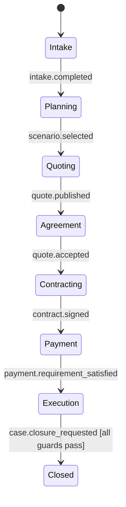
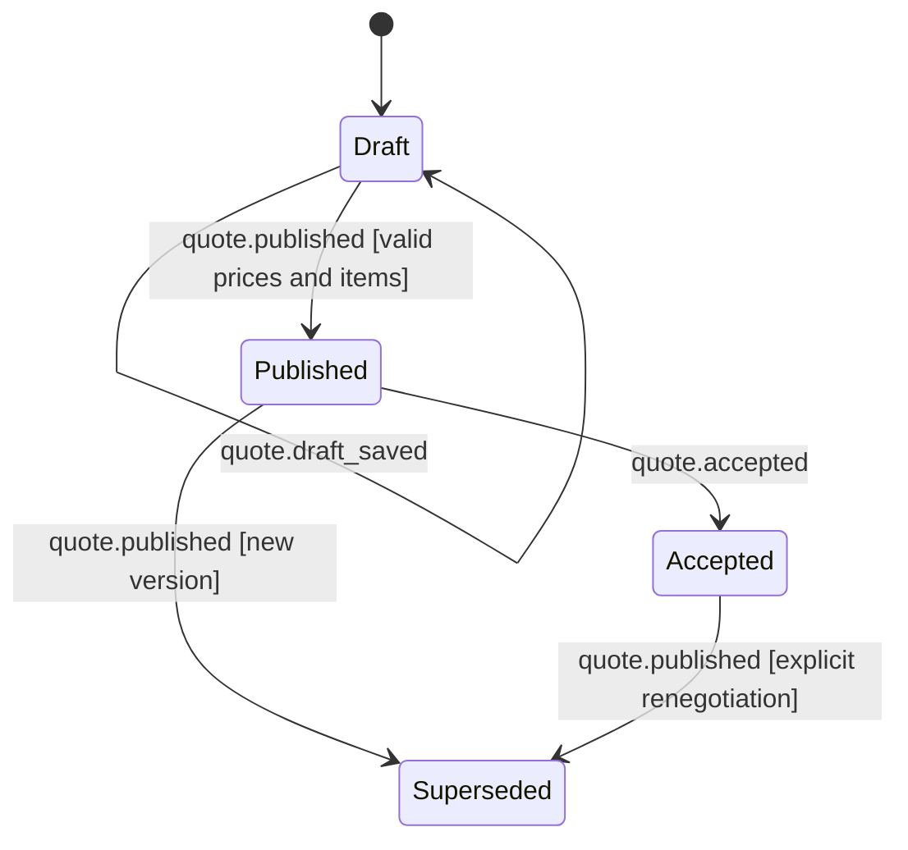
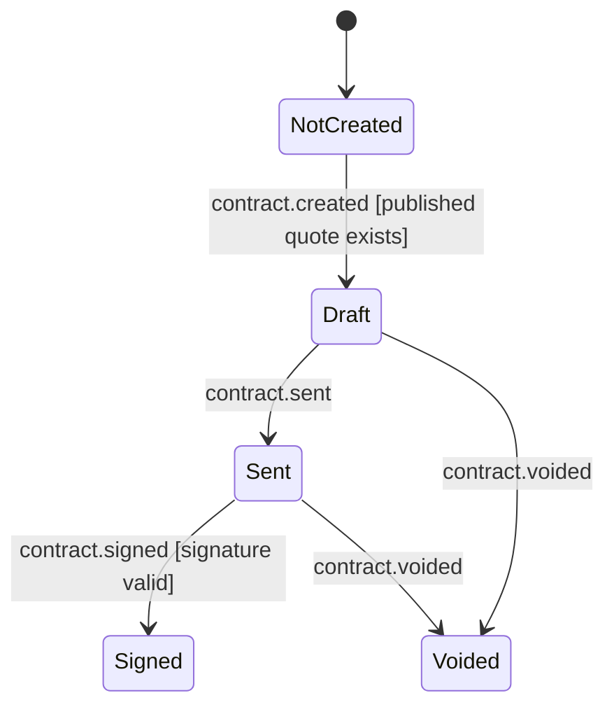
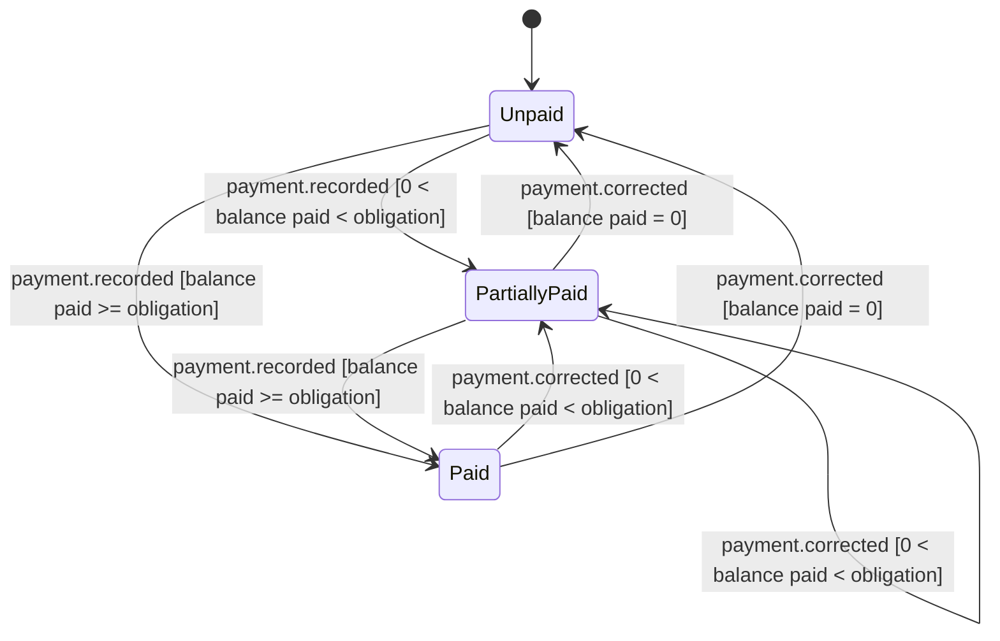
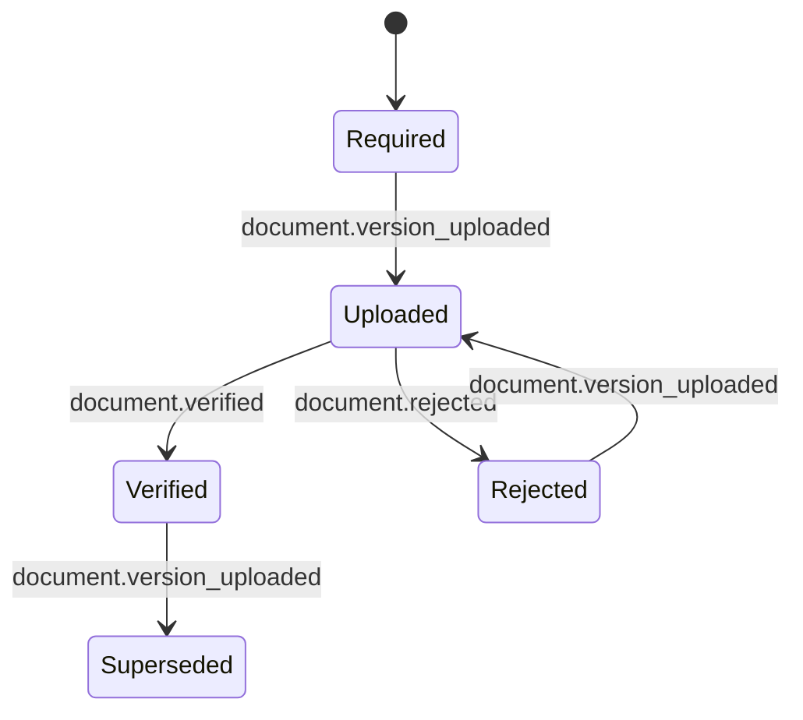
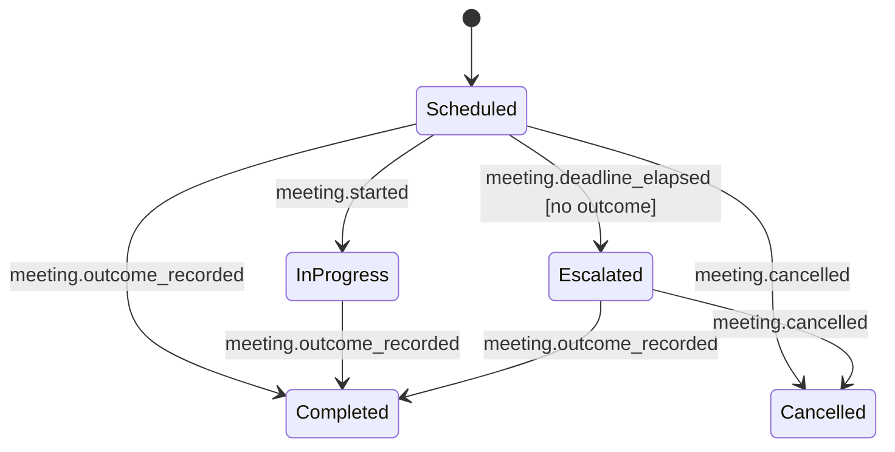
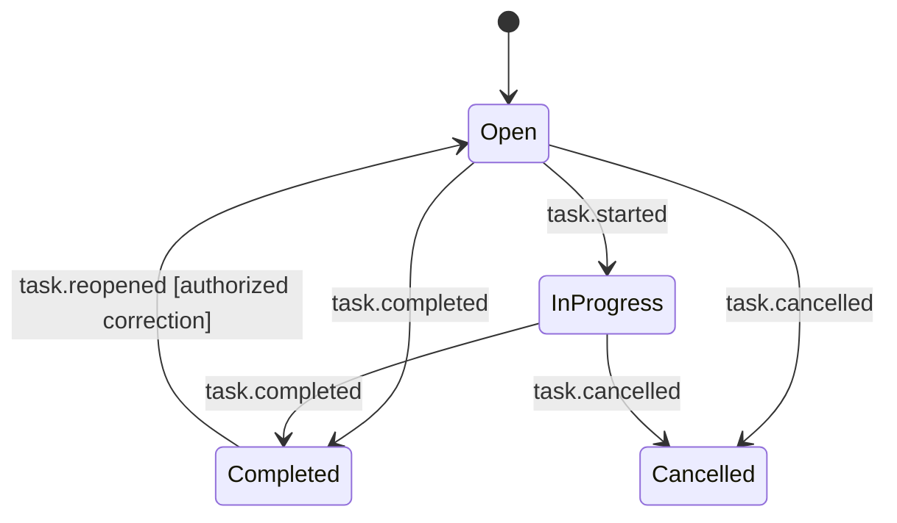

# State model and transition matrix

The diagrams define target pilot semantics. Current Prisma enums do not yet implement all states.

## State diagrams

“Needs attention” is a RiskProjection flag, not a Case lifecycle state. A blocker
prevents the guarded transition while leaving the Case in its current durable state.

## Transition matrix

| Aggregate | From | Event | Guard | To | Side effect | Audit event |
| --- | --- | --- | --- | --- | --- | --- |
| Case | Intake | `intake.completed` | required intake fields valid | Planning | project scenario-choice task | yes |
| Case | Planning | `scenario.selected` | exactly one supported scenario/version | Quoting | create scenario checklist | yes |
| Case | Quoting | `quote.published` | quote publish guards pass | Agreement | close send-quote task once | yes |
| Case | Agreement | `quote.accepted` | accepted version is current published version | Contracting | create contract task once | yes |
| Case | Contracting | `contract.signed` | signature valid and bound to quote version | Payment | create payment obligation | yes |
| Case | Payment | `payment.requirement_satisfied` | derived balance meets policy | Execution | create execution checklist | yes |
| Case | Execution | `case.closure_requested` | all scenario/docs/payment guards pass | Closed | freeze close summary | yes |
| Quote | Draft | `quote.draft_saved` | payload structurally valid | Draft | store mutable draft only | yes |
| Quote | Draft | `quote.published` | no unknown price, invalid item or double count | Published | immutable snapshot + client pointer | yes |
| Quote | Published | `quote.published` | explicit new valid version | Superseded | atomically move client pointer | yes |
| Quote | Published | `quote.accepted` | client has access to current published version | Accepted | create contract task once | yes |
| Quote | Accepted | `quote.published` | explicit renegotiation and valid new version | Superseded | atomically move client pointer | yes |
| Contract | NotCreated | `contract.created` | published quote exists | Draft | bind quote version | yes |
| Contract | Draft | `contract.sent` | recipient and immutable content valid | Sent | record delivery attempt | yes |
| Contract | Sent | `contract.signed` | valid signer/evidence | Signed | emit signed event | yes |
| Contract | Draft/Sent | `contract.voided` | authorized actor and reason | Voided | cancel active signature request | yes |
| Payment | Unpaid | `payment.recorded` | `0 < paid balance < obligation` | PartiallyPaid | append ledger entry | yes |
| Payment | Unpaid/PartiallyPaid | `payment.recorded` | `paid balance >= obligation` | Paid | append ledger entry | yes |
| Payment | PartiallyPaid | `payment.recorded` | `0 < paid balance < obligation` | PartiallyPaid | append ledger entry | yes |
| Payment | Paid | `payment.corrected` | resulting balance is positive and below obligation | PartiallyPaid | append reversal/correction | yes |
| Payment | PartiallyPaid | `payment.corrected` | resulting balance remains positive and below obligation | PartiallyPaid | append reversal/correction | yes |
| Payment | Paid/PartiallyPaid | `payment.corrected` | resulting balance is zero | Unpaid | append reversal/correction | yes |
| Document | Required/Rejected | `document.version_uploaded` | valid type/storage/checksum | Uploaded | enqueue verification task | yes |
| Document | Uploaded | `document.verified` | authorized reviewer | Verified | update readiness projection | yes |
| Document | Uploaded | `document.rejected` | authorized reviewer and reason | Rejected | create re-upload task once | yes |
| Document | Verified | `document.version_uploaded` | replacement file valid | Superseded | create new Uploaded version | yes |
| Meeting | Scheduled | `meeting.started` | actor authorized and meeting active | InProgress | record start | yes |
| Meeting | Scheduled/InProgress/Escalated | `meeting.outcome_recorded` | valid outcome and next action | Completed | project follow-up task | yes |
| Meeting | Scheduled/InProgress/Escalated | `meeting.cancelled` | authorized actor and reason | Cancelled | cancel reminders | yes |
| Meeting | Scheduled | `meeting.deadline_elapsed` | scheduled time passed, no outcome | Escalated | create follow-up task once | yes |
| Task | Open/InProgress | `task.completed` | actor authorized | Completed | record completion source | yes |
| Task | Open | `task.started` | actor authorized | InProgress | record assignee/start | yes |
| Task | Open/InProgress | `task.cancelled` | actor authorized and reason | Cancelled | record cancellation | yes |
| Task | Completed | `task.reopened` | authorized correction and reason | Open | record correction | yes |

Any missing `from/event/guard` pair is rejected, not coerced.
Any command producing a negative payment balance is rejected as invalid; it is not a state transition.
